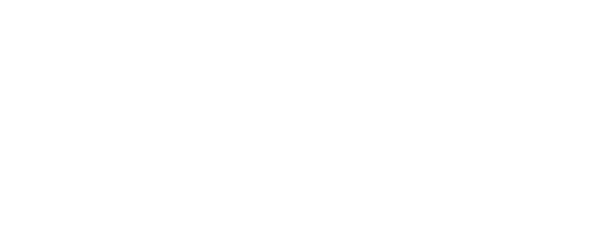
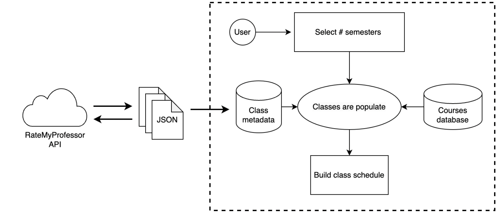

Final Project for Software Engineering 370.
Created by Josue N, Michael B, and Rutilo M

# Introduction
### Purpose 
TopClass is a startup looking to help get CSUSM students to graduation. The mission of TopClass is to help students navigate building their class schedules in preparation for graduation within their Major. 
About our project team

TopClass is a group of four experienced Computer Science majors taking a Software
Engineering course at California State University San Marcos. Our project team is dedicated to
making quality software for our clients.

### Product Scope
The scope of this project is local to CSUSM declared majors, focused on upper division courses needed for graduation. Relative to this, our intention is to make a scalable product focusing only on CS majors then expanding to STEM majors at CSUSM. Ultimately scaling this project for universities worldwide. 

### Statement of Work
Some things the acquirer’s should be expecting is ease of use where the software they’re using should be intuitive, reliable data where the information that is provided through the software is accurate, and support where the suppliers should fix anything the acquirer might need. Regarding the collaboration between the acquirer and supplier, we need to make sure that our support system is strong, that the communication between both parties is used often, and that the supplier responds accordingly to the feedback given.

### Dependencies and Constraints

The dependencies that will be included in this project include the Rate My Professor API, Selenium, Node.js, MYSQL, and all the frontend technologies. Constraints that we have to be aware of are corporate policies regarding the usage of third-party api’s, industry standards of how to develop a website, government regulations such as data protection laws, and business rules that could be set by the university. 

### Design, Development, and Implementation Methods
For building the project, the IDE to be used is Eclipse/IntelliJ. We will use Github to synchronize the development of the project and to back up project data. Our team follows the incremental model of software development in order to maximize the efficiency of the software development process.CSUSM will be the intellectual owner of the design documentation and will be reviewed by our programming group. We will follow this specific activity chart:

### Change Management
This project will maintain a detailed schedule and work plan to ensure the client receives the proposed product. A research stage has already been completed to guarantee all components within the current project scope will meet the needs of the client. Prototype, development, and review stages have been implemented alongside scheduled check-ins to help ensure the successful delivery of the proposed product. Changes in scope will only occur if there is a failure to complete scheduled timelines, however, these changes should not affect the base functionality of the product and will be resolved by the TopClass team. 

# Overall Description
### Product Functions
Student: Build class schedule for user defined # of semesters
Load classes for upper division classes 
Each class populates as a collapsible list containing all relative data: professors (who have taught and will teach specified course)
Provide metadata from ratemyprofessor and CSUSM course catalog
Add selected course with associated data to a schedule 

### Technical requirements

Small portions of the system requirements, the database software and the host server (if
required), will be outsourced from the CSUSM. The acquirer would need to have use of a mobile device with internet access in order to utilize this web application.

### Operating Environment
The application will be on a local host during the development process. The front end will be coded in Javascript/Typescript with VS Code. Working in tandem, React, a Javascript library for user interfaces, will optimize the user experience. The backend will be built in Java with IntelliJ with the Spring Boot framework allowing out of the box features for quick deployment. MySQL will be the database management system for storing and managing data. JEP (Java Embedded Python) will collaborate with a Python API to grab the necessary information from ratemyprofessors.com. The collaborations can be done in real time on IntelliJ’s Code with Me or pushed onto our repository on Github.

## Design and Implementation Constraints
The application will be tested locally on our personal computers. Testing would need to be done using CSUSM’s network to see whether any other problems may arise. As a personal project, extracting information from ratemyprofessors.com would be fine but if it is made public for anyone on the Internet to use, copyright policies might cause issues. The API should update every professor’s rating per each request. Also, the courses available would be tied to the CSUSM course catalog including only the current or upcoming semester. 